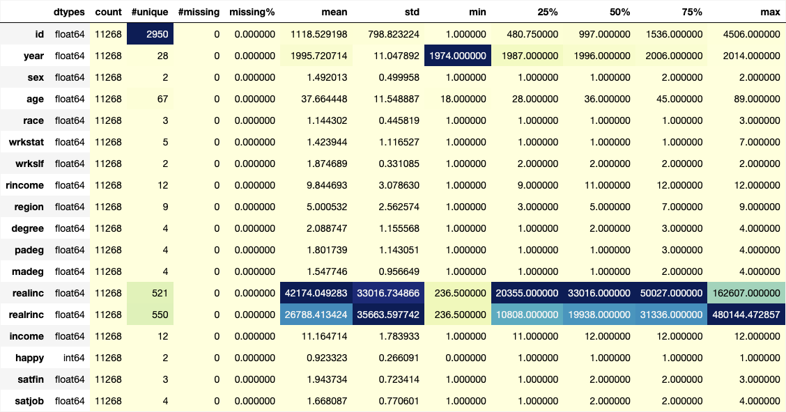
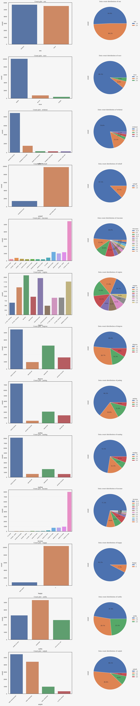
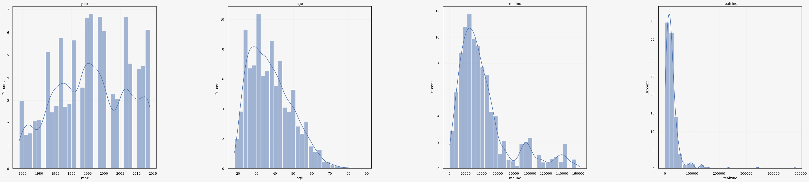
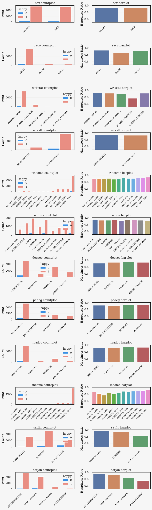
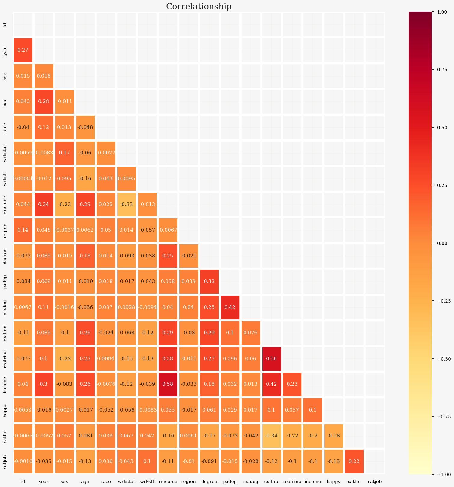
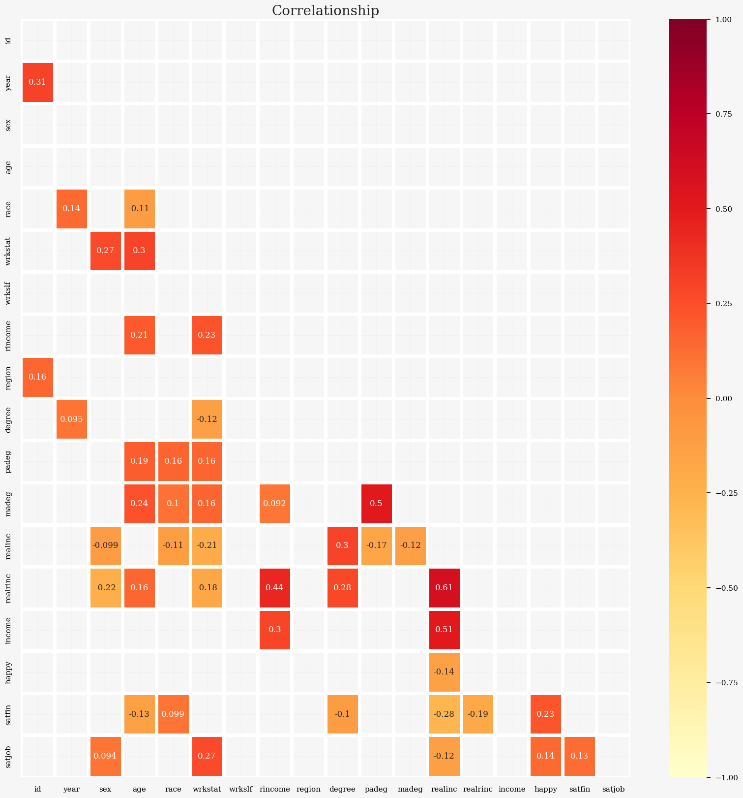

# Exploratory Data Analysis 
### - StudentID: 21900296
### - Name: Yoobin Park
### - 1st Major: Life Science (45)
### - 2nd Major: AI convergence (33)
 

<i> In this project, I tried to find out how respondents' environment and characteristis impact on their happiness </i>

  
## 1. Data overview  
First, I picked 18 relevant variables from the original dataset since the original data was too large to handle with my computer source. To investigate the factors for the happiness, basic informaiton, educational and economic environment of respondents and how respondents feel about his/her life and job were selected along with general happiness.

 
The followings are selected variables
   

* **Basic information of repondents**  
`YEAR`  GSS YEAR FOR THIS RESPONDENT  
`ID` RESPONDENT ID NUMBER  
`SEX` RESPONDENTS SEX  
`AGE` AGE OF RESPONDENT  
`RACE` RACE OF RESPONDENT  
`WRKSTAT` LABOR FORCE STATUS  
`WRKSLF` R SELF‐EMP OR WORKS FOR SOMEBODY  
`RINCOME` RESPONDENTS INCOME  
`REGION` REGION OF INTERVIEW (Assume this as a region where Respondents live)  

* **Educational & Economical environment of repondents**  
`DEGREE` RS HIGHEST DEGREE  
`REALINC` FAMILY INCOME IN CONSTANT \$  
`REALRINC` RS INCOME IN CONSTANT \$  
`INCOME` TOTAL FAMILY INCOME  

* **How responents feel about his/her life and job**  
`HAPPY` GENERAL HAPPINESS  
`SATJOB` WORK SATISFACTION  
`SATFIN` SATISFACTION WITH FINANCIAL SITUATION    

 
After selecting variables, the rows with `nan` values were dropped out.  
The rows with `IAP`(Invalid answer), `DK`(Don't know) were also deleted.
To clarify the status of `HAPPY`, I encoded `VERY HAPPY`, `PRETTY HAPPY` as 1 (HAPPY) and `NOT TOO HAPPY` was encoded as 0 (NOT HAPPY).
Finally, 11,268 rows and 18 columns were left after removing rows with any missing values. 
 

<figure>
  
  <figcaption> Table 1. Statistics summary of preprocessed data </figcaption>
</figure>

The selected data was collected from 1974 to 2014 and the average age of selected respondents is 37. All the data has 'float64' dtypes.
The categorical data and continuous data distribution are visualized in Figure 1 and Figure 2, respectively.

<figure>
  
  <figcaption>Figure 1. Countplot and pieplot of categorical variables </figcaption>
</figure>

<figure>
  
  <figcaption>Figure 2. Histogram of continuous variables </figcaption>
</figure>

  
## 2. Univariate analysis  
To investigate how the happy status varies across different variables, I conducted a comprehensive exploratory data analysis (EDA).  For continuous variables, I created histograms, box plots, bar plots, and violin plots to gain insights into how their distributions are differeht according to `HAPPY` status. For categorical variables, I used count plots and bar plots to compare the proportions of happy=1 within each category. Since the continuous data didn't show any differences in distribution between `HAPPY` and `NOT HAPPY`, only plots of categorical data is shown in Figure 3.

<figure>
  
  <figcaption>Figure 3. Countplot and Barplot of categorical variables</figcaption>
</figure>

### 2.1 Relationship between 'wrkstat' and Happiness  
Individuals working part-time ('wrkstat' = 'WORKING PARTTIME') tend to report lower happiness levels compared to those with other work statuses.

### 2.2 Relationship between 'income' and Happiness  
Although there isn't a clear trend in the `rincome` variable, you can see the proportion of `HAPPY` decreases as income from total family `income` decreases.

### 2.3. Relationship between Financial Satisfaction ('satfin') and Happiness  
People who are less satisfied with their financial situation tend to report lower happiness levels.

### 2.4. Relationship between Job Satisfaction ('satjob') and Happiness:
Lower job satisfaction ('satjob') seeems to be associated with reduced happiness. 

  
## 3. Multivariate analysis  
In order to gain a deeper understanding of the relationships between multiple variables and their impact on happiness, a multivariate analysis was conducted. One of the key methods used in this analysis was the creation of a correlation heatmap. The heatmap visually represents the correlation coefficients between different variables, allowing us to identify patterns, dependencies, and insights. 

<figure>
  
  <figcaption>Figure 4. Correlation between variables </figcaption>
</figure>

### 3.1 (ex) Correlation  
Unfortunately, I couldn't find any strong correlation(corr > 0.7) among any variables.
Although there was no significant correlation betweeen any variables, I could see `wrkstat`, `satjob`, `realinc`, and `satfin` were relatively have high correlations to `Happy` compared to other variables as shown in Figure 5.

<figure>
  
  <figcaption>Figure 5. Correlation between variables that has bigger correlation than average correlations </figcaption>
</figure>

  
## 4. Suggestion  
Although I couldn't find any variables that have strong correlation with happiness, I could find there is a tendency between respondents' satisfaction to job and their happiness. Therefore, **enhancing workplace satisfaction for improved well-being.** This analysis has revealed that variables related to job satisfaction (satjob) and financial well-being (realinc, satfin) partly play a role in influencing an individual's happiness (happy). However, there is no strong correlation among the variables, indicating a more complex relationship.

Therefore, we can provide following programs to enhance job satisfaction to increase happiness of individuals.  
 

1. Develop a comprehensive program aimed at improving workplace satisfaction (satjob) by addressing factors such as workload, work-life balance, recognition, and career growth. Implement surveys and feedback mechanisms to continuously assess and improve job satisfaction.

2. Financial Well-Being Workshops:  

 Organize workshops and educational programs focused on financial literacy and planning (realinc, satfin). Empower individuals with the knowledge and skills to manage their finances effectively, leading to reduced financial stress and increased financial satisfaction.

1. Data-Driven Decision-Making:  
Implement data collection and analytics to monitor the impact of the program on individuals' happiness. Continuously analyze the data to make data-driven decisions and improvements.
Community Engagement:

