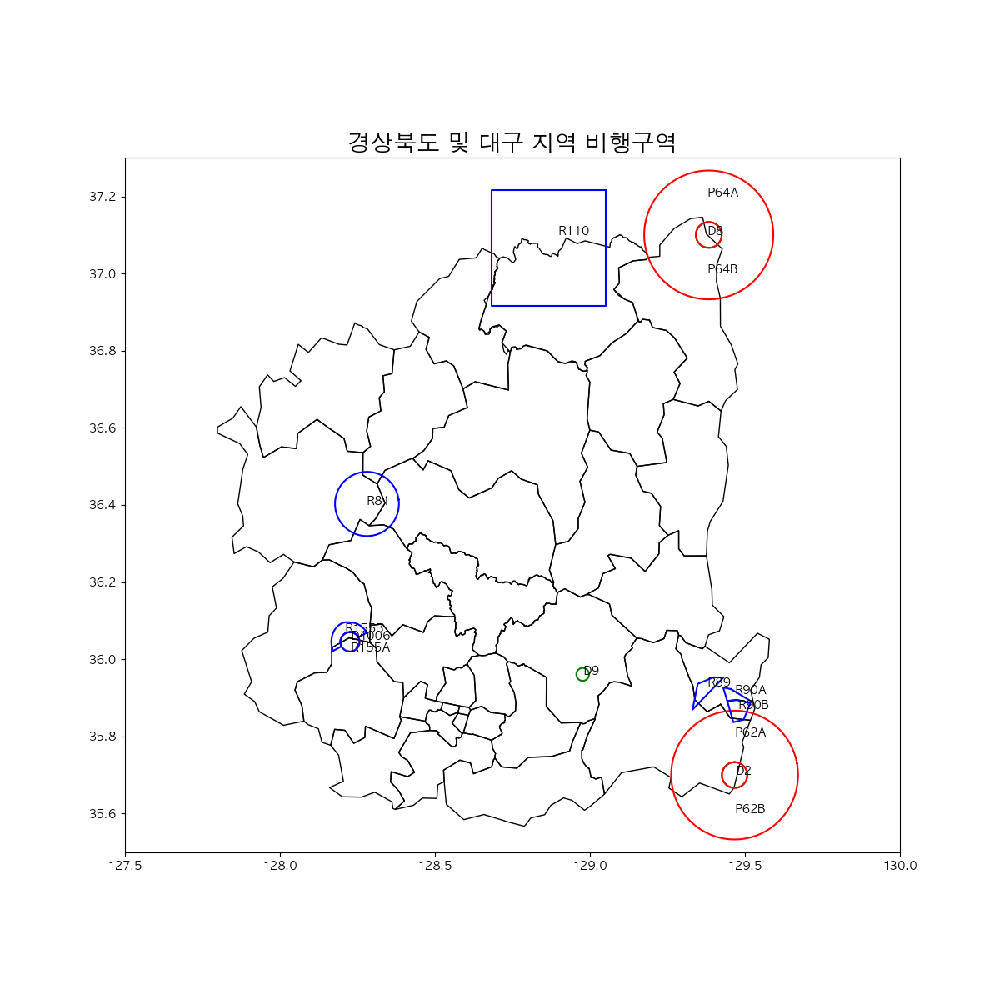
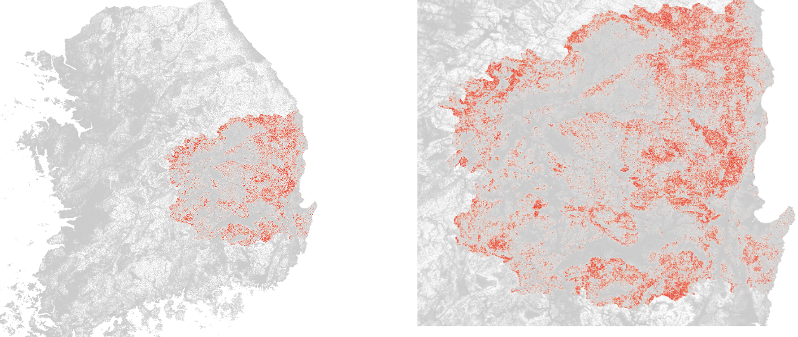
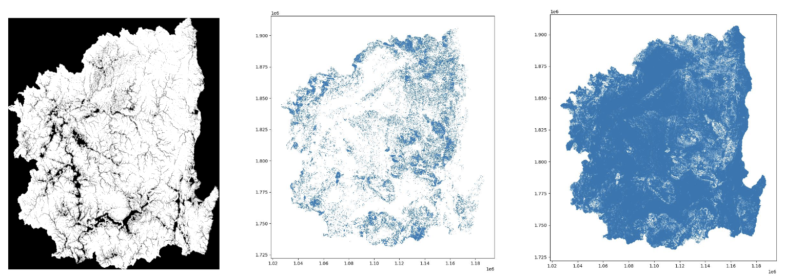
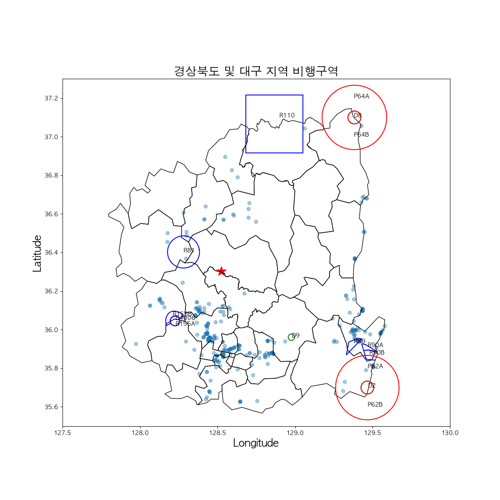
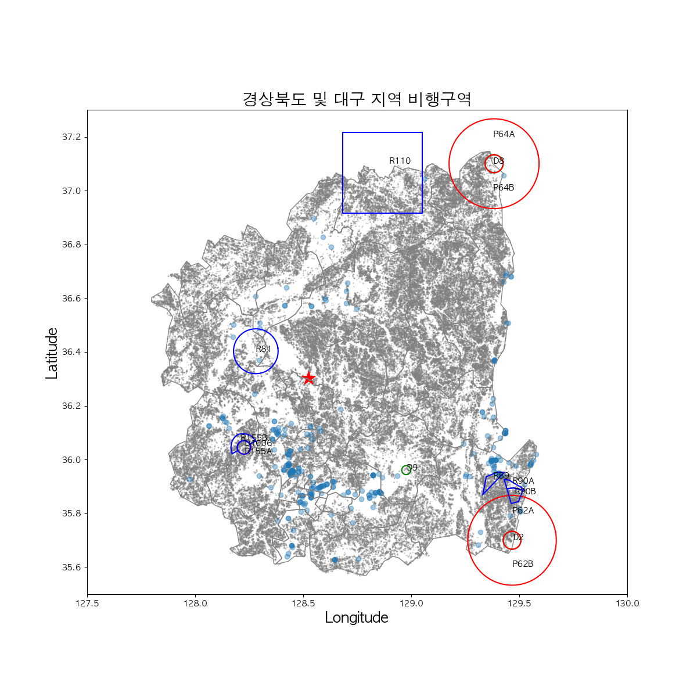

# Team Project (Contributors: PYB(Leader), PCH, CSK, PJC, and KYJ)
## Goal: Vertiport Placement in Gyeongsangbuk-do and Daegu for efficient middle-mile consignment of fresh food
See results of `mapping.ipynb` in [here](https://nbviewer.org/github/HowveYoobin/Big_Data_Design/blob/main/Team_project/mapping.ipynb)

## Progress of the project
### 1. Background Research
### 2. Scoped down the project topic and collected related data.
### 3. Mapped prohibited-, restricted-, and dangered- flight areas on the map of Gyeongsangbuk-do(w.o. Ulleung-do) and Daegu with Vworld API.  
    
<figure>
    
    <figcaption>Figure 1. No-flight zones in Daegu and Gyeongsangbuk-do(w.o. Ulleung-do</figcaption>
    </figure>

### 4. Marked locations with high slopes according to EASA vertiport guidelines on the map with QGIS and python.
* Marked unavailable slopes according to EASA vertiport guidelines on the map by QGIS.
    <figure>
    
    <figcaption>**Figure 2.** Unavailable slopes marked by QGIS </figcaption>
    </figure>
* Marked slopes according to EASA vertiport guidelines on the map by matplotlib.pyplot (Python).
    <figure>
    
    <figcaption>**Figure 3.** Available(middle) Unavailable slopes(right) marked by matplotlib.pyplot(Python)</figcaption>
    </figure> 

### 5. Marked warehouses, new-TK airport, and places with high slopes by matplotlib.pyplot.

  
  
  <figcaption align="center"><B>Figure 4.</B> Locations of the warehouses(blue point) and new TK airport(star) were marked on the left map. The places with unavailable slopes(gray point) were marked on the right map.</figcaption>

6. Finding out the relationship between warehouse size and the amount of delivery traffic in Hwaseong.
   * Reducing computational cost by using server
  
6. 기체 선정 및 middle mile에서 UAM의 필요성
