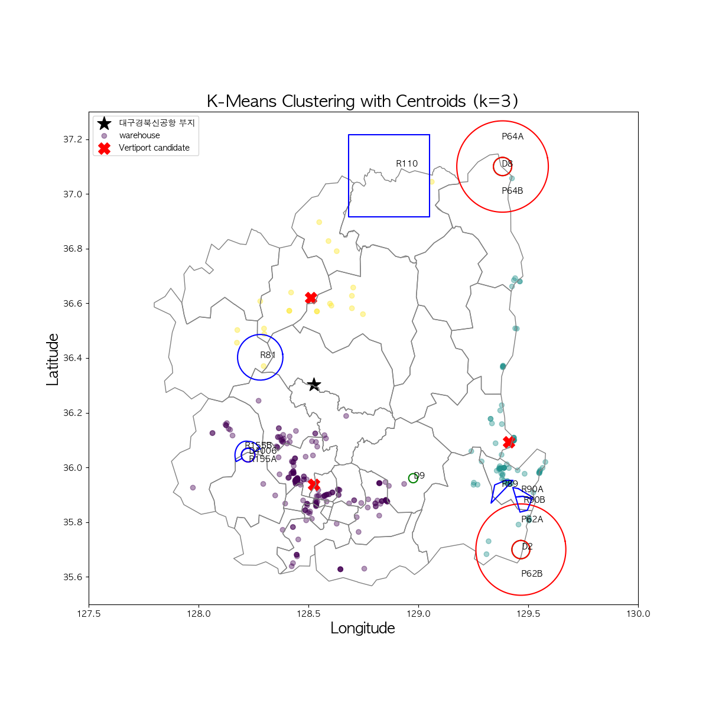
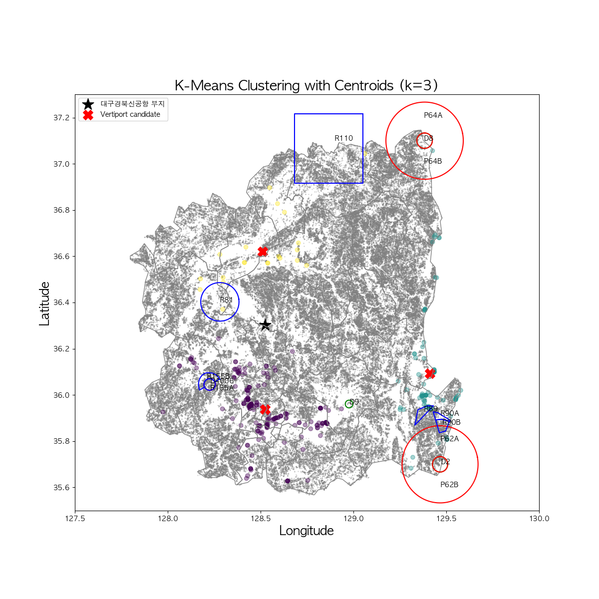
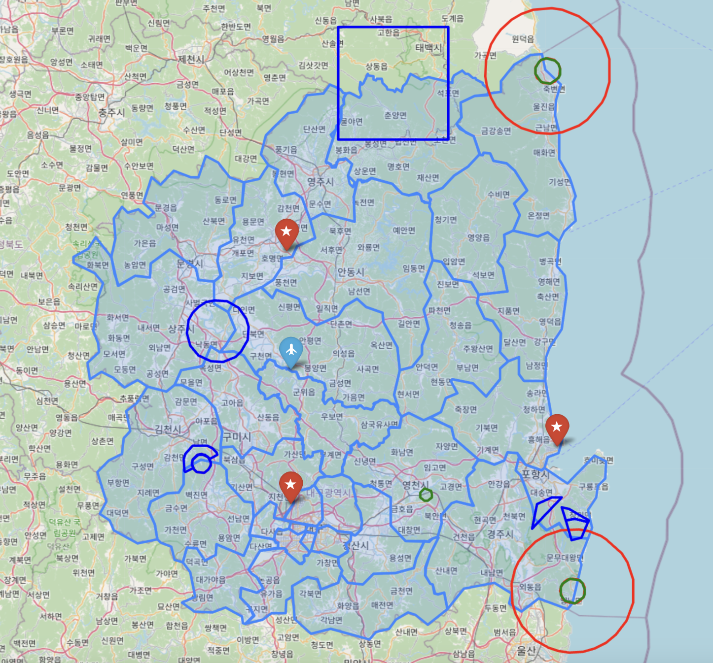
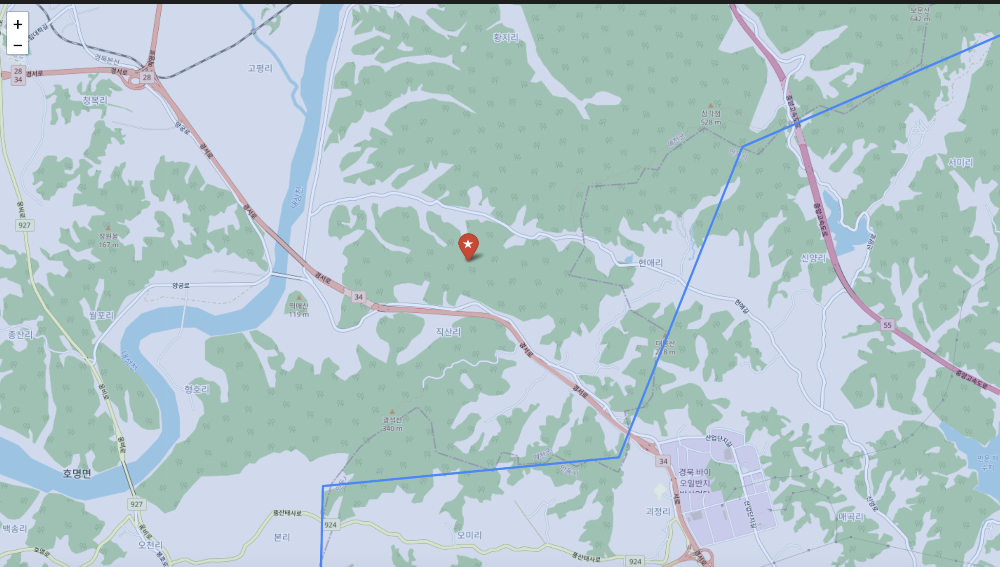
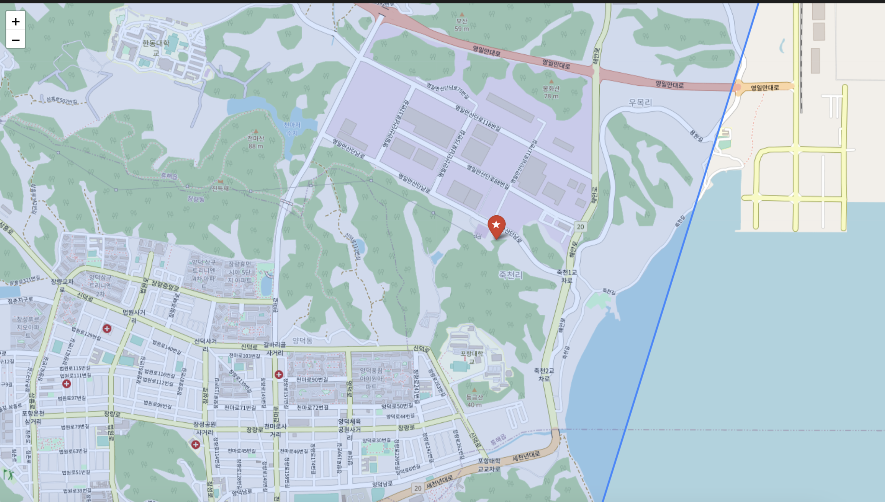
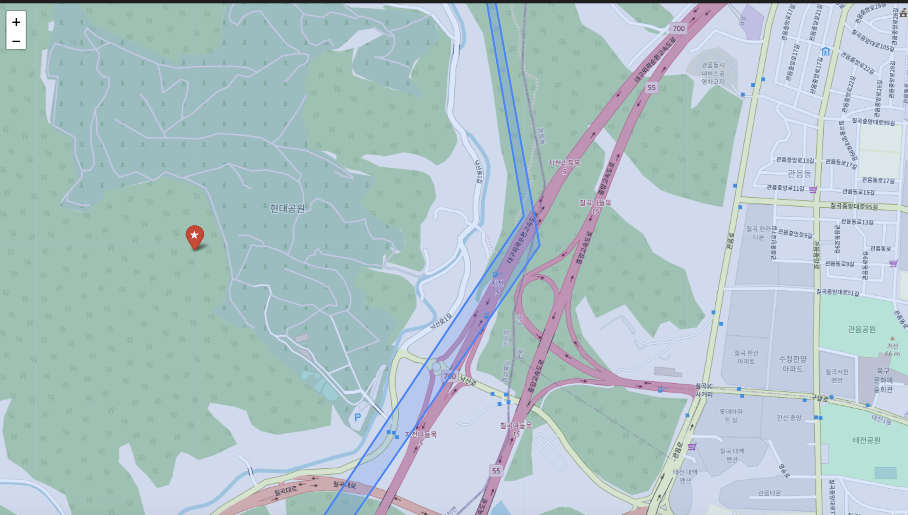

# Team Project (Contributors: PYB(Leader), PCH, CSK, PJC, and KYJ)
## Goal: Vertiport Placement in Gyeongsangbuk-do and Daegu for efficient middle-mile consignment of fresh food
See visualized results of `mapping.ipynb` [here](https://nbviewer.org/github/HowveYoobin/Big_Data_Design/blob/main/Team_project/mapping.ipynb)  
[1.](https://github.com/HowveYoobin/Big_Data_Design/blob/main/Team_project/README.md#completed) Completed  
   [1.1.](https://github.com/HowveYoobin/Big_Data_Design/blob/main/Team_project/README.md#1-background-research) Background Research  
   [1.2.](https://github.com/HowveYoobin/Big_Data_Design/blob/main/Team_project/README.md#2-scoped-down-the-project-topic-and-collected-related-data) Scoped down the project topic and collected related data  
   [1.3.](https://github.com/HowveYoobin/Big_Data_Design/blob/main/Team_project/README.md#3-mapped-prohibited--restricted--and-dangered--flight-areas-on-the-map-of-gyeongsangbuk-dowo-ulleung-do-and-daegu-with-vworld-api) Mapped prohibited-, restricted-, and dangered- flight areas on the map of Gyeongsangbuk-do(w.o. Ulleung-do) and Daegu with Vworld API.  
   [1.4.](https://github.com/HowveYoobin/Big_Data_Design/blob/main/Team_project/README.md#4-marked-locations-with-high-slopes-according-to-easa-vertiport-guidelines-on-the-map-with-qgis-and-python) Marked locations with high slopes according to EASA vertiport guidelines on the map with QGIS and python.  
   [1.5.](https://github.com/HowveYoobin/Big_Data_Design/blob/main/Team_project/README.md#5-marked-warehouses-new-tk-airport-and-places-with-high-slopes-by-matplotlibpyplot) Marked warehouses, new-TK airport, and places with high slopes by matplotlib.pyplot.  
   [1.6.](https://github.com/HowveYoobin/Big_Data_Design/blob/main/Team_project/README.md#6-selected-vertiport-candidates-by-using-the-k-means-algorithm-k--3) Selected vertiport candidates by using the K-Means algorithm. (K = 3)  
[2.](https://github.com/HowveYoobin/Big_Data_Design/blob/main/Team_project/README.md#we-are-working-on) We are working on...  

## Completed
### 1. Background Research
### 2. Scoped down the project topic and collected related data.
### 3. Mapped prohibited-, restricted-, and dangered- flight areas on the map of Gyeongsangbuk-do(w.o. Ulleung-do) and Daegu with Vworld API.  
<figure>
    
    <figcaption><B>Figure 1.</B> No-flight zones in Daegu and Gyeongsangbuk-do(w.o. Ulleung-do)</figcaption>
    </figure>

### 4. Marked locations with high slopes according to EASA vertiport guidelines on the map with QGIS and python.
* Marked unavailable slopes according to EASA vertiport guidelines on the map by QGIS.
    <figure>
    
    <figcaption><B>Figure 2.</B> Unavailable slopes marked by QGIS </figcaption>
    </figure>
* Marked slopes according to EASA vertiport guidelines on the map by matplotlib.pyplot (Python).
    <figure>
    
    <figcaption><B>Figure 3.</B> Available(middle) and unavailable slopes(right) marked by matplotlib.pyplot(Python)</figcaption>
    </figure> 

### 5. Marked warehouses, new-TK airport, and places with high slopes by matplotlib.pyplot.

  
  
  <figcaption align="center"><B>Figure 4.</B> Locations of the warehouses(blue point) and new TK airport(star) were marked on the left map. The places with unavailable slopes(gray point) were marked on the right map.</figcaption>

### 6. Selected vertiport candidates by using the K-Means algorithm. (K = 3)
* K was determined by eye inspection and we could see 3 clusters of warehouses.

  
  
  <figcaption align="center"><B>Figure 5.</B> Locations of the vertiport candidates(red X) were marked on the left map. The locations of the vertiport candidates(red X) and places with unavailable slopes(gray point) were marked on the right map. New TK airport was indicated as a black star.</figcaption>

* Detailed inspection for selected vertiport candidates by folium.

  
  <figcaption align="center"><B>Figure 6.</B> Selected Vertiport candidates marked on folium map. Star(red) = vertiport candidates. Plane(blue) = TK new airport</figcaption>

  
  
  
  <figcaption align="center"><B>Figure 7.</B> Detailed locations of 3 vertiport candidates.</figcaption>

---

## We are working on...
* Finding out the relationship between warehouse size and the amount of delivery traffic in Hwaseong.
   * Reducing computational cost by using server
* Preparing for the final-term presentation
