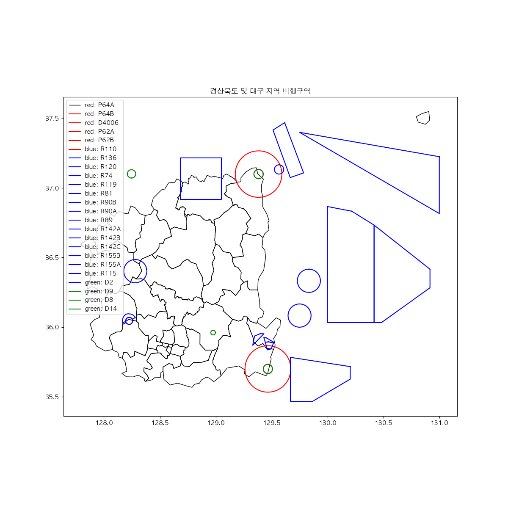
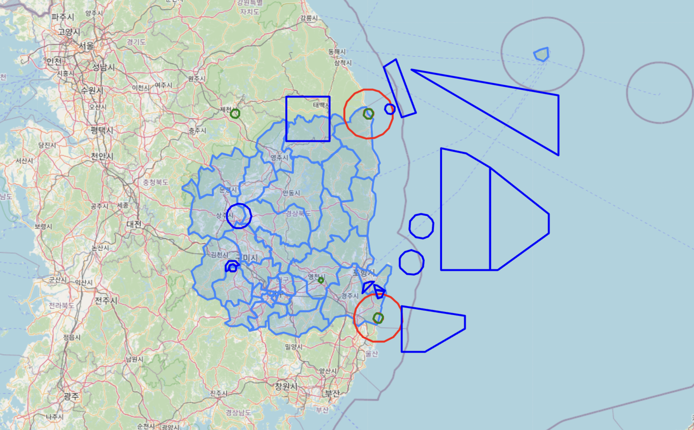

# Team Project
## Contriutors: PCH, CSK, PJC, and KYJ
## Vertiport Placement in Gyeongsangbuk-do and Daegu for efficient middle-mile consignment of the fresh food

### Progress
1. Background Research
2. Scoped down project topic and collected data.
3. Mapped prohibited-, restricted-, dangered- flight area on the map of Gyeongsangbuk-do and Daegu with Vworld API.
    <figure>
    
    <figcaption>Figure 1. No-flight zones(matplotlib)</figcaption>
    
    <figcaption>Figure 2. No-flight zones(Folium)</figcaption>
    </figure>
4. Marked locations with slopes more than 26 degrees on the map with QGIS.
    <figure>
     26"/>
    <figcaption>Figure 3. No-flight zones(matplotlib)</figcaption>
    </figure>
