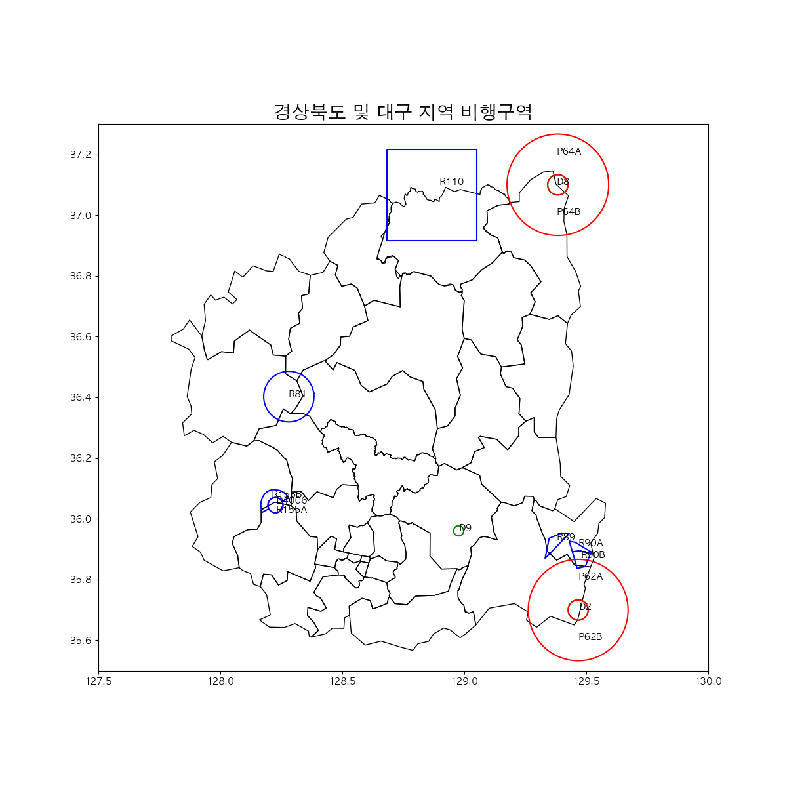
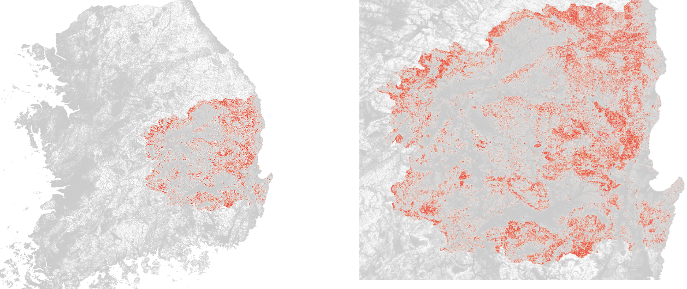
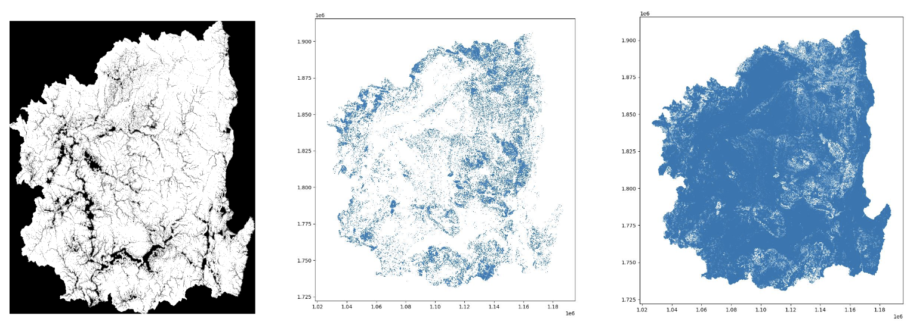

# Team Project
## Contriutors: PCH, CSK, PJC, and KYJ
## Vertiport Placement in Gyeongsangbuk-do and Daegu for efficient middle-mile consignment of the fresh food
---
mapping.ipynb -> https://nbviewer.org/github/HowveYoobin/Big_Data_Design/blob/main/Team_project/mapping.ipynb

### Progress
1. Background Research
2. Scoped down project topic and collected data.
3. Mapped prohibited-, restricted-, dangered- flight area on the map of Gyeongsangbuk-do and Daegu with Vworld API.
    <figure>
    
    <figcaption>Figure 3. No-flight zones in Daegu and Gyeongsangbuk-do(without Ulleung-do</figcaption>
    </figure>
    
4. Marked locations with slopes more than 26 degrees on the map with QGIS.
    <figure>
    
    <figcaption>Figure 4. QGIS slopes(>26)</figcaption>
    </figure>  
    * QGIS -> python matplotlib
    <figure>
    
    <figcaption>Figure 5. Python slopes (matplotlib)</figcaption>
    </figure> 

5. Marked 

5. Finding out the relationship between warehouse size and the amount of delivery traffic in Hwaseong.
   * Reducing computational cost by using server
  
6. 기체 선정 및 middle mile에서 UAM의 필요성
