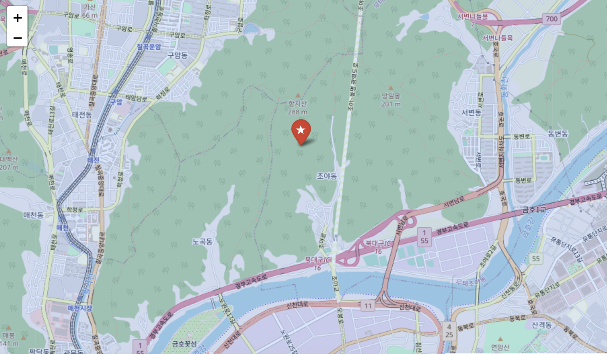

# Team Project 
## Goal: Vertiport Placement in Gyeongsangbuk-do and Daegu for efficient middle-mile consignment of fresh food

## Contributors
PYB(Leader), PCH, CSK, PJC, and KYJ
---
## Refer these sources for detailed process of the project.
View visualized results of `mapping.ipynb` [here](https://nbviewer.org/github/HowveYoobin/Big_Data_Design/blob/main/Team_project/mapping.ipynb) 

---
# Summarized Process
* This is a simple description of the project. If you want more detailed and formal description of process,
  *  View project proposal from [here](https://github.com/HowveYoobin/Big_Data_Design/blob/main/Proposal/vertiport_final_proposal.pdf)
  *  View project final presentation(.pdf) [here](https://github.com/HowveYoobin/Big_Data_Design/blob/main/Team_project/Final_presentation.pdf)

### 1. Background Research
### 2. Scoped down the project topic and collected related data.
### 3. Mapped prohibited-, restricted-, and dangered- flight areas on the map of Gyeongsangbuk-do(w.o. Ulleung-do) and Daegu with Vworld API.  
<figure>
    
    <figcaption><B>Figure 1.</B> No-flight zones in Daegu and Gyeongsangbuk-do(w.o. Ulleung-do)</figcaption>
    </figure>

### 4. Marked locations with high slopes according to EASA vertiport guidelines on the map with QGIS and python.
* Marked unavailable slopes according to EASA vertiport guidelines on the map by QGIS.
    <figure>
    
    <figcaption><B>Figure 2.</B> Unavailable slopes marked by QGIS </figcaption>
    </figure>
* Marked slopes according to EASA vertiport guidelines on the map by matplotlib.pyplot (Python).
    <figure>
    
    <figcaption><B>Figure 3.</B> Available(middle) and unavailable slopes(right) marked by matplotlib.pyplot(Python)</figcaption>
    </figure> 

### 5. Marked warehouses, new-TK airport, and places with high slopes by matplotlib.pyplot.

  
  
  <figcaption align="center"><B>Figure 4.</B> Locations of the warehouses(blue point) and new TK airport(star) were marked on the left map. The places with unavailable slopes(gray point) were marked on the right map.</figcaption>

### 6. Selected vertiport candidates by using the K-Means algorithm. (K = 3)
* K was determined by eye inspection and we could see 3 clusters of warehouses.

  
  
  <figcaption align="center"><B>Figure 5.</B> Locations of the vertiport candidates(red X) were marked on the left map. The locations of the vertiport candidates(red X) and places with unavailable slopes(gray point) were marked on the right map. New TK airport was indicated as a black star.</figcaption>

* Detailed inspection for selected vertiport candidates were conducted using folium.

  
  <figcaption align="center"><B>Figure 6.</B> Selected Vertiport candidates marked on folium map. Star(red) = vertiport candidates. Plane(blue) = TK new airport</figcaption>

  
  
  
  <figcaption align="center"><B>Figure 7.</B> Detailed locations of 3 vertiport candidates.</figcaption>

* We've identified four limitations that need to be addressed when determining vertiport candidates using the K-means algorithm:
   1. It may assign centroids to unavailable locations, such as the middle of the sea or mountains.
   2. It ignores slope. (Slope of the ground is important to build vertiport according to "EASA Vertiport guidelines")
   3. We didn't take into account the demand of each warehouse. Some warehouses with bigger delivery volume may frequently use UAM for delivery, while others may not.
   4. We ignored the accessibility from the ground traffic.

### 7. A relationship between warehouse size and the amount of delivery traffic in Hwaseong has been established by Linear Regression.
* We established a linear relationship between warehouse width in Hwaseong and demand in order to assign weights to the data points (warehouse locations) on the map. (We couldn't utilize delivery data from Gyeongsangbuk-do since the data from Hwaseong was the only available dataset for delivery demand.)

$$
{y = 46.67x − 75649.97}
$$

  
  <figcaption align="center"><B>Figure 8.</B> The linear regression equation for warehouse width(x) and demand(y) is expressed as follows: y = 46.67x − 75649.97</figcaption>

### 8. Warehouse data points, new-TK airport, and places were newly marked with high slopes by matplotlib.pyplot.
* We predicted the demand for each data point using the warehouse size and the aforementioned linear regression formula. Then, we represented the points on the map by overlaying them in proportion to their corresponding demand. This ensured that the centroid (vertiport candidates) would be located close to warehouses with higher demand.

  
  <figcaption align="center"><B>Figure 9. Locations of the warehouses(blue point) and new TK airport(star), and available slopes(yellow) are marked. The intensity of the blue color represents the level of demand. </B> </figcaption>

### 9. Selected vertiport candidates by using the K-Means algorithm. (K = 3, K = 2)
* K was determined by eye inspection and integrated result of sillhouette method and elbow method. We determined 3 clusters of warehouses by eye inspection like before, and K = 2 was resulted by sillhouette method and elbow method.
  

  
  
  
  <figcaption align="center"><B>Figure 10.</B> Optimal K was determined by eye inspection (K = 3), elbow method, and sillhouette method (K = 2)</figcaption>

### 10. Final vertiport candidates were determined
* We added constraints, such as slopes and territory boundaries, to prevent the assignment of candidates to unavailable locations. Additionally, we ensured that centroids moved to the closest warehouse to guarantee accessibility from ground traffic.

  
  <figcaption align="center"><B>Figure 11. Constraints were added. </B> </figcaption>

* Detailed inspection was conducted by Google map using resulted vertiport candidate coordinates.

  
  
  <figcaption align="center"><B>Figure 12.</B> Final vertiport candidates were determined (K = 2, Elbow method & Silhouette method). </figcaption>

  
  
  <figcaption align="center"><B>Figure 13.</B> Final vertiport candidates were determined (K = 3, Eye inspection). </figcaption>

### 11. As is vs To be
* We created a 'What if' scenario to compare the travel time of middle-mile delivery by ground traffic and UAM.
* We found out one of our vertiport candidates can reduce the travel time by 56.6% compared to the existing middle-mile delivery method. (We did not consider sky path for this scenario)

  
  <figcaption align="center"><B>Figure 14. As is vs To be Scenario </B> </figcaption>

